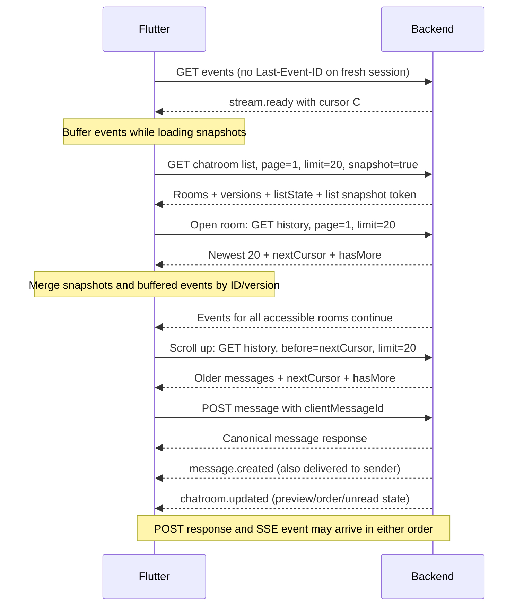

# Chatroom SSE API proposal

Status: **proposed for backend review; not implemented or BE-confirmed**. Inspected Flutter branch: `feat/chatroom-sse`.

Replace the open chatroom's 15-second polling with **one authenticated, user-scoped Server-Sent Events (SSE) connection per foreground app session**, covering every chatroom the authenticated user can access. The app routes events by type and `chatRoomId` to update the chatroom list, unread counts, and loaded conversation messages. Opening or switching rooms does not create another SSE connection. Keep REST for loading the list/history, uploading attachments, sending messages, and marking messages read. Keep FCM for notifications outside the active chatroom and when the app is in the background.

This proposal covers updates across **all accessible chatrooms**, room access changes, and scroll-to-load older messages. Load the newest **20 messages** on room entry, then fetch **20 older messages per request** when the user scrolls up. The current 9999 limit was a workaround to make history accessible without pagination; reduce it only when scroll pagination is implemented. Typing indicators, presence, and message editing/deletion are outside this change. See [pagination settings](PAGINATION.md).

## 1. Current Flutter behavior

These findings come from the Flutter code; backend internals and response fields unused by Flutter have not been verified.

| Area            | Current behavior                                                                                                                                   | Source                                                                               |
| --------------- | -------------------------------------------------------------------------------------------------------------------------------------------------- | ------------------------------------------------------------------------------------ |
| Initial history | `GET /api/chatroom/history/{chatRoomId}`, page 1, limit 9999                                                                                       | [chat_message_provider.dart](../lib/provider/chat_message_provider.dart)             |
| Chatroom list   | `GET /api/chatroom/list`, 20 per page; initial load replaces rooms and later pages append; no shared live-event handling                           | [chatroom_list_provider.dart](../lib/provider/chatroom_list_provider.dart)           |
| Updates         | Every 15 seconds, request history with `startAt = latest createdAt + 100 ms`                                                                       | [chatroom_page.dart](../lib/pages/chatroom_page.dart), message provider              |
| Rendering       | Reversed `ListView`, newest message at index 0; user on right, seller/admin on left; text, images, video, sending/read labels                      | [chat_message_widget.dart](../lib/features/chatroom/widget/chat_message_widget.dart) |
| Sending         | Insert a local `pending` message, upload files, `POST /api/chatroom/message/{chatRoomId}`, then reload history even on failure                     | Message provider                                                                     |
| Read status     | `PUT /api/chatroom/message/{chatRoomId}/read`, body `{"readerType":"user"}`; client also guesses outgoing messages were read when a reply arrives  | Message provider                                                                     |
| Push            | `chat_message` FCM payload identifies `chatRoomId`; foreground notifications for the current room are suppressed; notification taps open that room | [main.dart](../lib/main.dart), [root_layout.dart](../lib/layout/root_layout.dart)    |
| Authentication  | Shared Dio attaches a bearer token, with a 401 retry path; connect and receive timeouts are both 60 seconds                                        | [dio_provider.dart](../lib/provider/dio_provider.dart)                               |

Issues to resolve during migration:

- Polling returns early for an empty message list, so the first incoming message is not fetched by the timer.
- The timestamp offset can skip messages within that 100 ms interval; appending results has no ID deduplication.
- A read receipt alone does not update existing messages through polling. Read status should come from BE events, not inferred from replies.
- Message state is shared rather than keyed by room. Notification navigation can stack chatroom pages, so late responses can affect another room.
- Polling has no app foreground/route visibility handling. SSE must have explicit connection ownership and cleanup.
- The token refresh path does not save the new access token into system state. Fix this before reconnecting SSE through the same authentication flow.

## 2. Proposed API changes at a glance

All names and new fields below are proposals for BE agreement. Existing endpoints and response fields remain compatible with older apps.

| Endpoint                                                   | Proposed change                                                                                                                                                                          |
| ---------------------------------------------------------- | ---------------------------------------------------------------------------------------------------------------------------------------------------------------------------------------- |
| **New:** `GET /api/chatroom/events`                        | User-scoped SSE for all accessible rooms; initial connection establishes a stream boundary; reconnect replays after `Last-Event-ID`                                                      |
| `GET /api/chatroom/list`                                   | Retain 20 per request; add versioned room summaries and authoritative `listState`; support stable snapshot pagination described below                                                    |
| `GET /api/chatroom/history/{chatRoomId}`                   | Support `limit=20` and an optional exclusive `before` cursor for older messages; return `hasMore` / `nextCursor`; add message fields described below; no SSE cursor on history responses |
| `POST /api/chatroom/message/{chatRoomId}`                  | Accept optional `clientMessageId` for retry deduplication; return the canonical message; publish `message.created`                                                                       |
| `PUT /api/chatroom/message/{chatRoomId}/read`              | Retain request shape; publish authoritative `messages.read` when read state changes                                                                                                      |
| File upload, room creation/detail, FCM device registration | Retain existing contracts                                                                                                                                                                |

Room creation/access changes and changes to last message, activity order, or unread state also publish `chatroom.updated` / `chatroom.removed` as specified below. The stream's room set is derived by BE from the authenticated user, including rooms not yet loaded into the paginated list. Do not require the app to submit room IDs to subscribe.

New message fields used consistently in history, send response, and events:

- `clientMessageId`: nullable string; supplied by the sending client, echoed by BE. Older clients may omit it.
- `version`: positive integer, increasing whenever that message's exposed state changes, including `isRead`. This prevents an older POST response or replay from overwriting a newer read receipt.

Retain existing `id`, `chatRoomId`, `senderType` (`user`, `seller`, `admin`), `content`, `attachments`, `isRead`, and `createdAt`. Use ISO 8601 UTC timestamps with `Z`. Attachments retain their existing canonical fields (`id`, `url`, `name`, `mimeType`, `size`, `createdAt`, `updatedAt`). Normalize absent attachments to an empty list in new responses; Flutter can continue accepting legacy nulls.

## 3. Shared stream and REST snapshots must not leave a gap

Recommended flow:



Example history response (empty room):

```json
{
  "success": true,
  "data": {
    "messages": [],
    "total": 0,
    "page": 1,
    "limit": 20,
    "totalPages": 0,
    "hasMore": false,
    "nextCursor": null
  }
}
```

On a fresh foreground session, connect first without `Last-Event-ID`. BE atomically establishes a committed user-feed boundary C and guarantees delivery of all authorized events after C. It sends `stream.ready` with C before those events. Flutter registers the event router/buffers before requesting REST snapshots, then merges snapshots with concurrent events by entity ID/version. REST list/history reads started after readiness must include committed changes through C, including read states; BE must avoid a lagging replica returning older state. This also works when the user has no rooms or an opened room has no messages. Preserve existing pagination metadata semantics; the example's `totalPages` is illustrative.

Register a room's buffer before starting its history request, including when opening another room later on the same connection. Apply read patches that race with the request after merging its response. An event for a closed, uncached room does not trigger a history fetch: route its summary event to the list and fetch history on entry. Loaded retained room caches may be updated, or explicitly invalidated for reload before reuse. The shared cursor advances only after all relevant local updates or invalidations are recorded. Bound buffers; if a snapshot takes too long or a buffer overflows, cancel that snapshot and resynchronize instead of silently discarding events.

BE must retain all relevant changes after that boundary and bridge replay to live delivery without a gap. Publish events only after the corresponding mutation commits, with durable recovery if a process crashes between committing and broadcasting. A transactional outbox or equivalent durable change log is appropriate; transient pub/sub alone cannot provide replay.

Proposed replay retention: **at least 24 hours**, subject to BE capacity confirmation. Events have a stable total order within the authenticated user's feed, across all accessible rooms, and may be redelivered. Cursors are opaque, user-scoped strings, not timestamps or message IDs. Flutter does not parse or numerically compare them. Each device/session has its own checkpoint; one device consuming an event must not acknowledge it for another. History ordering should be deterministic, newest first, with a documented tie-breaker such as `createdAt DESC, id DESC`.

On reconnect with retained local state, send the last applied user-feed event ID and replay strictly after it before transitioning to live delivery. `stream.ready` then echoes that requested checkpoint, not the current feed head, so it cannot skip replay. Full resync invalidates the list and all room caches, cancels in-flight snapshots/pages, opens a fresh stream, and repeats snapshot merging for the list and visible room. Other rooms load on demand. A history or list REST response never overwrites the shared SSE checkpoint.

### Older-message pagination

Use a separate history cursor for scrolling; it must not share the meaning of the SSE replay cursor:

| Field                                      | Meaning                                                                                                          |
| ------------------------------------------ | ---------------------------------------------------------------------------------------------------------------- |
| `stream.ready.cursor` / durable event `id` | User-feed boundary/checkpoint owned by the shared SSE controller; independent of any room's pagination           |
| `nextCursor`                               | Opaque position before the oldest message in this history page; pass it as `before` to fetch the next older page |
| `hasMore`                                  | Whether another older history page is available; when false, `nextCursor` is null                                |

Initial request: `GET /api/chatroom/history/{chatRoomId}?page=1&limit=20`. BE returns the newest messages, `nextCursor`, and `hasMore`. Keep existing pagination fields compatible for older clients. For a nonempty room with more history, `nextCursor` is a non-null string and `hasMore` is true.

Older-page request:

```http
GET /api/chatroom/history/room_123?before=<URL-encoded-nextCursor>&limit=20
Authorization: Bearer <accessToken>
```

In `before` mode, do not send `page`; BE should reject mixed `page` and `before` parameters. Return `messages`, `limit`, `hasMore`, and `nextCursor`. Existing `page` / `limit` requests remain supported for older apps. The new app uses `hasMore` rather than totals or page counts to decide when to stop.

BE should use an exclusive keyset boundary with a stable order, proposed `(createdAt, id)`, encoded in the opaque cursor. Keep ordering keys immutable. New messages arriving through SSE must not shift which older messages the cursor selects. Validate the cursor's room scope; malformed or wrong-room history cursors return `400 CHAT_HISTORY_CURSOR_INVALID`. A history cursor is independent of the 24-hour SSE replay retention; older messages remain accessible for as long as the chat history itself is retained.

Flutter behavior:

- Trigger loading near the older end of the reversed list (visually the top). Allow only one older-page request at a time and stop when `hasMore` is false. If the first page does not fill the viewport, allow another page to load until scrolling is possible or history ends.
- Append older results to the older end of the in-memory list; merge with current state by message ID/version instead of replacing it. Continue accepting SSE events during the request. Never advance the SSE cursor from an older-page response or move the history cursor based on an SSE message.
- Preserve the visible message and its offset when older pages or live messages arrive. Auto-scroll for new incoming messages only when already near the latest end; otherwise indicate that new messages are available.
- Show a loading/retry control at the older end. Failure retains loaded messages and the same history cursor so retry does not skip a page.
- Handle read events racing with an in-flight history response: retain the newer receipt patch until that response is merged. For unloaded messages with no pending response, a later history request reads their authoritative current state; do not create empty bubbles for receipt-only events.
- On a full SSE resync, cancel/invalidate in-flight older requests and reset history pagination to the fresh newest-20 snapshot. Do not stitch stale cached older pages onto it as though there were no gap. All older history remains reachable by scrolling again. Ordinary reconnects with valid replay retain loaded pages and scroll position.

Each history page must reflect committed message/read state at its own consistent read point. Version merging prevents an older page response from undoing a read event already applied by Flutter. No automatic fetch of the entire history is needed.

## 4. SSE endpoint and events

```http
GET /api/chatroom/events
Authorization: Bearer <accessToken>
Accept: text/event-stream
Last-Event-ID: user_feed_abc:41
```

Derive the user and accessible room set from the bearer token. Authorize each delivered/replayed payload against current access, not just access when the stream opened. New room access automatically joins the feed; revoked access stops its content delivery without closing other rooms' updates. Do not trust a client-supplied user ID or sender/reader role to grant access. Do not put bearer tokens in URLs.

```http
HTTP/1.1 200 OK
Content-Type: text/event-stream; charset=utf-8
Cache-Control: no-cache, no-transform
X-Accel-Buffering: no
```

SSE uses UTF-8, blank-line-delimited events, named `event` fields, and `id` values carried back in `Last-Event-ID`. The Flutter parser must handle partial network chunks, split Unicode characters, CR/LF variants, multiline `data`, comments, and `retry` fields. [SSE protocol specification](https://html.spec.whatwg.org/multipage/server-sent-events.html).

**`stream.ready`** — control event sent first on every connection. It has no durable `id`. On a fresh connection, `cursor` is the atomically established starting boundary; on a replay connection it echoes the requested checkpoint. The controller may initialize an empty session from the fresh boundary, but must not mark snapshots synchronized until their buffered events have been merged.

```text
event: stream.ready
data: {"schemaVersion":1,"cursor":"user_feed_abc:41"}

```

Required durable events follow. Their IDs belong to the same user feed, even when consecutive events refer to different rooms:

**`message.created`** — every committed message, including messages from the current client, other devices, sellers, and admins. `message` is the full canonical message.

```text
id: user_feed_abc:42
event: message.created
data: {"schemaVersion":1,"chatRoomId":"room_123","message":{"id":"msg_456","chatRoomId":"room_123","clientMessageId":"75f415d5-e34f-43c0-b5b0-54e82a95b9e7","version":1,"senderType":"user","content":"你好","attachments":[],"isRead":false,"createdAt":"2026-09-29T02:00:00.000Z"}}

```

**`messages.read`** — authoritative changes to specific messages, even when nobody sends a reply.

```text
id: user_feed_abc:43
event: messages.read
data: {"schemaVersion":1,"chatRoomId":"room_123","readerType":"seller","readAt":"2026-09-29T02:01:00.000Z","messages":[{"id":"msg_456","version":2,"isRead":true}]}

```

`readerType` describes the actor; each listed `isRead` value must have the same meaning as the history response. BE must confirm how seller/admin readers affect user messages and vice versa. Do not broadcast a blanket instruction to mark all outgoing messages read. Split large read updates into bounded batches with separate event IDs. Repeated read requests with no changes need not emit events. All write paths, including the seller/admin application, must publish these events.

**`chatroom.updated`** — complete, recipient-specific list projection when a room becomes accessible or its preview, metadata, activity order, or unread state changes. Publish it alongside message/read events whenever the room summary changes. It must contain enough data to render a room not previously loaded by the app, using the existing list item's `product`, `variant`, and `order` representations where applicable. Example for a room without product/order associations:

```text
id: user_feed_abc:44
event: chatroom.updated
data: {"schemaVersion":1,"chatRoomId":"room_123","room":{"id":"room_123","userId":"user_123","accountId":null,"productId":null,"productVariantId":null,"status":"active","product":null,"variant":null,"order":null,"totalUnread":0,"lastMessage":{"id":"msg_456","chatRoomId":"room_123","clientMessageId":"75f415d5-e34f-43c0-b5b0-54e82a95b9e7","version":2,"senderType":"user","content":"你好","attachments":[],"isRead":true,"createdAt":"2026-09-29T02:00:00.000Z"},"createdAt":"2026-09-28T02:00:00.000Z","updatedAt":"2026-09-29T02:01:00.000Z","lastActivityAt":"2026-09-29T02:00:00.000Z","version":7},"listState":{"version":18,"totalRooms":3,"totalUnread":2}}

```

Room `version` is monotonic for that user's view of the room, including access changes; it is distinct from message `version`. `lastActivityAt` defines list order, proposed descending with room ID as a tie-breaker. A read receipt should not move the room to the top just because `updatedAt` changed. `listState` is authoritative across **all** accessible rooms: `totalRooms`, aggregate unread-message count `totalUnread`, and an independent increasing `version`. Include the same versioned summaries and `listState` in REST list responses. Never calculate the overall unread badge by summing only the loaded 20 rooms, or increment counts once per received event.

**`chatroom.removed`** — room deleted or access revoked. Send only the room ID, removal version/reason, and updated list state; no message content after access is revoked.

```text
id: user_feed_abc:45
event: chatroom.removed
data: {"schemaVersion":1,"chatRoomId":"room_123","roomVersion":8,"reason":"access_revoked","listState":{"version":19,"totalRooms":2,"totalUnread":2}}

```

Flutter removes the room, clears its cached messages and pending requests, and shows an unavailable state if it is open. Retain a versioned tombstone so an older in-flight list response cannot restore it. A later access grant uses a higher version and a full `chatroom.updated`; history then loads on entry. During replay, filter out content for rooms no longer authorized and still deliver the necessary removal/invalidation. If BE cannot reconstruct access changes safely within retained replay, require full resync. Another user's cursor is never accepted.

### Event routing and list pagination

| Event              | Chatroom list / badges                                                | Room messages                                                                                           |
| ------------------ | --------------------------------------------------------------------- | ------------------------------------------------------------------------------------------------------- |
| `message.created`  | Associated `chatroom.updated` supplies canonical preview/order/counts | Merge into loaded matching room; buffer during history loading; no history request for an uncached room |
| `messages.read`    | Associated `chatroom.updated` supplies any changed counts/preview     | Patch matching loaded messages by version; preserve patches racing with REST                            |
| `chatroom.updated` | Upsert summary by room ID/version; reorder; replace newer `listState` | Update visible room metadata; access grant allows future history load                                   |
| `chatroom.removed` | Remove summary; apply authoritative list state                        | Clear room state, cancel requests, show unavailable if open                                             |

BE must durably publish the message/read event and any associated room-summary change from the same committed mutation, including seller/admin writes and reads from another device. They are separate frames and can arrive separately, but both must be replayable; Flutter does not guess list counts from a message frame. No-op writes need not emit events.

Keep list requests at 20. Since room ordering is mutable, ordinary `page=2` against the latest list can skip rooms after live reordering; ID deduplication alone cannot fix that. Proposed additive list mode: `GET /api/chatroom/list?page=1&limit=20&snapshot=true` returns `data.listSnapshot`, `data.listState`, and versioned `data.rooms` alongside existing pagination metadata. Fetch later pages using `page=N&limit=20&listSnapshot=<URL-encoded-token>` against the same frozen ordering/membership. Bind the token to the authenticated user and list query; reject invalid/foreign tokens. Define a snapshot lifetime (proposed 15 minutes); expired tokens return `410 CHATROOM_LIST_SNAPSHOT_EXPIRED` and restart list pagination only, without resetting SSE or room histories. Legacy requests without snapshot mode retain current behavior.

Apply live versioned summaries/removals over those snapshot pages, deduplicate by room ID, and retain newer overrides/tombstones while the snapshot is in use. Recheck authorization when serving a snapshot page; never return revoked content. Preserve frozen page boundaries even if revoked entries are omitted; use the snapshot's `totalPages` to advance, not page length. Live `listState.totalRooms` describes current membership, not the frozen pagination boundary. Newly accessible rooms can be inserted from events even if absent from the snapshot. An event for an unloaded room carries a full summary, so it can be inserted in order without fetching history. Bound cached overlays; if necessary, invalidate and reload the list snapshot instead of retaining every historical room indefinitely.

List snapshot reads must be causally current at creation, as described in section 3. If the list has never been loaded, keep only current list state and mark summaries for initial load; do not create an unbounded offscreen list. On entry, register a buffer before the snapshot request and merge concurrent events.

Send a comment heartbeat after `stream.ready` and every **15 seconds** while idle:

```text
: heartbeat

```

Heartbeats and control events have no new durable event ID. Only successfully handled durable events advance the app's saved cursor after initial readiness. If BE can no longer maintain continuity after opening a stream, send `event: stream.reset` with `data: {"reason":"resync_required"}`, then close; Flutter performs the shared-stream resync in section 3. Do not silently skip missing events.

## 5. Sending and read behavior

Keep sending over REST; SSE is the server-to-client update channel.

The new app adds a UUID `clientMessageId` to the existing POST body. BE enforces uniqueness for `(authenticated sender, chatRoomId, clientMessageId)`. Retrying the same request returns the same canonical message without creating another message/event. Reusing a key for different content or attachments returns `409 CLIENT_MESSAGE_ID_CONFLICT`. Keep the key with the stored message so retries remain deduplicated. Older clients that omit the field keep their existing behavior.

Proposed successful POST response: `{"success":true,"data":{"message":<canonical message>}}`. The current Flutter code checks only `success`; BE should confirm whether an existing response shape needs to be preserved or extended.

Flutter reconciles its pending bubble using `clientMessageId`, deduplicates by server message ID, and merges only newer message versions. POST responses never advance the SSE cursor. Keep receipt patches for messages whose POST confirmation has not arrived yet so they are applied when the canonical message arrives. This handles an SSE event arriving before its HTTP response, as well as a response lost after a successful commit.

Remove the full history reload after each send and keep SSE running during uploads/sends. Retain failed content/attachments for retry instead of silently losing the draft. An attachment upload failure should fail that send visibly rather than submit an incomplete attachment list.

Keep the existing mark-read request on successful room entry and after displaying new incoming messages while the room is foreground and visible. Receiving an event for another room must not mark that room read. Coalesce repeated calls during replay. Treat it as independent of send state. BE must confirm whether it marks all messages as of request time; if exact displayed-message boundaries are required, agree an optional `upToMessageId` extension before implementation. Incoming read events update the UI without triggering another read request. Marking a room read on another device must update this app's unread count through its user feed.

## 6. Reconnection, authentication, and infrastructure

These status codes and timings are proposed application behavior, not automatic guarantees of SSE:

| Condition                                       | Backend response / Flutter handling                                                                                                   |
| ----------------------------------------------- | ------------------------------------------------------------------------------------------------------------------------------------- |
| No cursor                                       | Fresh subscription: establish user-feed boundary, send `stream.ready`, then live events; Flutter loads REST snapshots while buffering |
| Valid cursor                                    | Send `stream.ready` echoing the requested checkpoint, replay strictly after it across accessible rooms, then live events in order     |
| Malformed cursor / cursor for another user      | `400 CHAT_STREAM_CURSOR_INVALID` / `403`; reject without exposing feed contents                                                       |
| Expired or otherwise unavailable cursor         | `410 CHAT_STREAM_CURSOR_EXPIRED`; invalidate shared cached state and perform fresh stream/snapshot bootstrap                          |
| Invalid/expired authentication                  | `401`; coordinate one token refresh, persist the token, retry once; stop and require login if that fails                              |
| Stream access forbidden                         | `403`; stop reconnecting and show an access/unavailable state                                                                         |
| One room becomes unavailable                    | `chatroom.removed`; clear that room but keep the user stream running; its REST APIs return `403` / `404`                              |
| Rate limit                                      | `429`, with `Retry-After`; wait before retrying                                                                                       |
| Network error, EOF, heartbeat silence, or `5xx` | Reconnect with last applied cursor using exponential backoff and jitter (1–30 seconds); respect server retry delays                   |

Return JSON errors before starting the SSE response. Reject cursors belonging to another user. For an established connection, BE must define token-expiry/session-revocation enforcement; proposed behavior is to close at expiry or session revocation and enforce authorization on reconnect. Room-only access changes use removal events and delivery filtering. Never continue delivering room content after access is revoked.

Flutter uses a **45-second inactivity watchdog** against the proposed 15-second heartbeat. Keep visible messages during temporary disconnection and show a small reconnecting state. Resume with the cursor only while the corresponding list/room state or explicit cache invalidations are retained; a cold launch starts the stream-first bootstrap. Do not persist a cursor alone without its matching state. Cancel the old connection before opening its replacement; discard callbacks belonging to an obsolete session or snapshot generation. If SSE is temporarily unavailable, REST may still display data, but mark it unsynchronized and repeat snapshot merging when a fresh connection is established.

Infrastructure must flush events promptly and disable response buffering/caching on this route. With nginx, `proxy_buffering off` or an effective `X-Accel-Buffering: no` response supports immediate forwarding; verify proxy configuration does not ignore it. [nginx proxy buffering documentation](https://nginx.org/en/docs/http/ngx_http_proxy_module.html#proxy_buffering).

Check the actual load balancer/CDN idle and maximum request durations, compression buffering, and concurrent connection limits in staging. Multi-instance deployments need shared replay storage and event fanout. Release subscriptions when clients disconnect, bound slow-client queues, and disconnect/resync clients that fall behind rather than consume unlimited memory. Heartbeats keep idle streams active; they do not query chat history.

## 7. Flutter implementation after BE agreement

| Files / area                                                          | Planned work                                                                                                                                                                                                                                                                                     |
| --------------------------------------------------------------------- | ------------------------------------------------------------------------------------------------------------------------------------------------------------------------------------------------------------------------------------------------------------------------------------------------ |
| New `lib/service/chatroom_sse_service.dart`                           | One user-scoped streaming transport, SSE parsing, cancellation, heartbeat watchdog, replay/retry handling                                                                                                                                                                                        |
| New session-level SSE provider/controller                             | Own connection and shared checkpoint; initialize at authenticated foreground lifecycle; route events to list and room state; buffer snapshot races and handle full resync                                                                                                                        |
| `lib/provider/chatroom_list_provider.dart`                            | Versioned room upsert/removal/reordering, authoritative unread/list state, frozen list pagination and live overlays; invalidate on logout                                                                                                                                                        |
| `lib/provider/chat_message_provider.dart`                             | Room-scoped state and history cursor, `hasMore` and independent older-page loading/error state, routed event reducer, ID/version deduplication, pending-send reconciliation; use `AppConstants.paginationPageSize` (20) when pagination ships; remove timestamp polling; no owned SSE connection |
| `lib/models/chatroom.dart` and `lib/models/chatroom_list.dart`        | Parse history/list pagination fields, summary/message versions, activity order and list state; typed event payloads                                                                                                                                                                              |
| `lib/pages/chatroom_page.dart`                                        | Scroll controller and older-page trigger/loading/retry; remove polling timer; register visible room/history buffer with shared controller; manage mark-read visibility                                                                                                                           |
| Chat message/input widgets                                            | Stable message/attachment keys, preserve scroll position during updates, explicit sending/failed state and retry                                                                                                                                                                                 |
| `lib/provider/dio_provider.dart`                                      | Share reliable auth refresh; persist refreshed token; stream-specific timeout/response settings without changing ordinary REST behavior                                                                                                                                                          |
| `lib/main.dart`, authenticated root layout, and notification handling | Start/stop shared controller on authentication/app lifecycle; preserve notification routing; manage foreground FCM listener lifetime; suppress same-room alerts only while that room is actually active                                                                                          |

Use the existing Dio dependency (locked at 5.9.0) with `ResponseType.stream` on mobile; Dio exposes the response byte stream. Its stream support does not supply SSE parsing or replay policy. Review the stream request's receive timeout separately and use explicit cancellation plus the watchdog. [Dio streaming documentation](https://pub.dev/packages/dio#get-response-stream).

Key message state by authenticated session and room, or use a room family invalidated on logout. The shared connection stays alive throughout the logged-in foreground app session, including while neither the list nor a chatroom is visible. Leaving/switching a room only changes its UI observer and read/notification visibility; it must not close the stream. Close the stream, reconnect timer, and transport subscription on background, logout, account change, or session-controller disposal. Foreground resume reconnects/replays once for the session. Restoring a covered route must restore its active-room notification state. Handle late HTTP responses with session/snapshot checks and clear all user-specific caches on logout. Keep connection status separate from loaded messages and send progress.

This proposal targets the mobile app. If Flutter Web is also required, validate its streaming transport and CORS for `Authorization` and `Last-Event-ID`; native browser `EventSource` does not expose arbitrary request headers.

## 8. Push notifications remain in place

Keep the current FCM contract: notification title/body plus data containing `command: "chat_message"` and `chatRoomId`. SSE updates list state and loaded room messages; receiving an SSE message does not itself show another local notification. A push is not a substitute for replay or an authoritative message payload.

Use FCM for background/terminated-app notifications and preserve notification-tap navigation. Foreground notification messages are not visibly presented by default on Android/iOS, so retain the app's deliberate local-notification handling. [Firebase Flutter message handling](https://firebase.google.com/docs/cloud-messaging/flutter/receive-messages).

Do not stop sending push merely because a user has an SSE connection: another device may own it, or that connection may be stale. Suppression should reflect the currently visible foreground room. An event for another room updates its list summary/badges while FCM may show the notification; do not suppress every chat notification just because the shared stream is connected. FCM handlers must not separately increment unread counts already owned by versioned SSE/REST list state.

## 9. Acceptance checks and rollout

- Empty room receives its first message immediately, without a send or manual refresh.
- Exactly one SSE connection exists per logged-in foreground app session. Navigating between rooms, the list, and unrelated pages neither opens extra streams nor disconnects the shared stream.
- An event for room A updates its preview/order/unread count while room B is open, without altering B's messages, marking A read, or fetching A's history. New accessible rooms appear even if absent from loaded list pages.
- Replayed events and other-device reads never double-count unread messages. List snapshot pagination remains complete during live reordering/inserts/removals; an older page cannot overwrite newer summaries or restore revoked rooms.
- Entry loads at most 20 messages; scrolling up fetches older messages in batches of at most 20 until all retained history is reachable. Check rooms with 0, 1, 20, 21, and more than 9999 messages, including identical creation timestamps.
- Live messages arriving during older-page requests cause no skipped/duplicate messages, lost read receipts, or scroll jumps. Older-page failures can be retried without losing loaded history; repeated scroll triggers do not issue overlapping requests.
- Older-page responses never replace the SSE cursor. Ordinary reconnect preserves loaded pages; full resync resets pagination and rejects late responses from the previous snapshot.
- Changes before readiness are reflected in REST snapshots; changes during list/history loading are merged from buffered events. Reconnect replays changes across rooms without gaps when replay transitions to live delivery.
- Sender, seller/admin, and second-device messages render once, including attachments. POST-before-event, event-before-POST, duplicate delivery, and lost POST response all reconcile correctly.
- Read receipts update without a new reply; an older send response cannot revert `isRead`.
- Disconnect/reconnect replays missed events across all rooms using one user checkpoint; expired cursors trigger shared resync of list/visible room and invalidate other caches. Malformed events or unsupported schemas cause a controlled resync/error, not silent cursor advancement or an endless tight retry loop.
- Auth expiry refreshes once; forbidden stream access stops; another user's cursor is rejected; revoked room content is withheld even during replay. Removal clears only that room; a later grant restores it with a newer version. Multiple devices have independent checkpoints. Logout/account changes and rapid room switches leave no subscriptions or state leaks.
- Background/resume and notification taps preserve the existing FCM experience. Repeated login does not duplicate foreground notification listeners.
- Parser handles fragmented/multiple frames and split Chinese/emoji UTF-8. Staging through the real proxy delivers events promptly and survives idle periods.
- No timer-driven history requests while SSE is healthy; older history is fetched on scroll and history is reloaded only for initial load/full resync. No history reload after a successful send. Initial and older-history requests use 20, and unrelated list pagination remains 20.

Deploy BE changes additively, verify the contract in staging, then implement and release Flutter. Keep an explicit rollout switch for the existing polling client if rollback is needed; do not run polling and SSE simultaneously. Monitor active streams, reconnect rate, replay/resync rate, delivery lag, and authorization failures without logging message content or bearer tokens.

## 10. Decisions requested from BE

1. Confirm the user-scoped `GET /api/chatroom/events` route, server-derived accessible rooms, bearer authentication, per-delivery/replay authorization, dynamic room grants/removals, and proxy support.
2. Confirm stream-first `stream.ready` bootstrap and REST consistency, one ordered user-feed checkpoint, durable publication/replay, retention (proposed 24 hours), independent device checkpoints, and full-resync behavior.
3. Confirm older-history `before` / `nextCursor` / `hasMore`, exclusive stable ordering, 20-message requests, history cursor validation, and compatibility with existing page-based clients.
4. Confirm `message.created` / `messages.read` / `chatroom.updated` / `chatroom.removed`, canonical message and recipient-specific room versions, list activity ordering, authoritative list/unread counts, and `isRead` semantics. Confirm every sender/read/access-change path emits events.
5. Confirm the POST canonical response and optional `clientMessageId` retry deduplication.
6. Confirm mark-read scope, heartbeat interval, retry/error contract, and continued FCM delivery.
7. Confirm 20-item list snapshot pagination, token lifetime/errors, authorization filtering, and backward compatibility with existing list clients.

Once these are agreed, the Flutter changes can proceed against a concrete API contract. No runtime code has been changed as part of this proposal.
